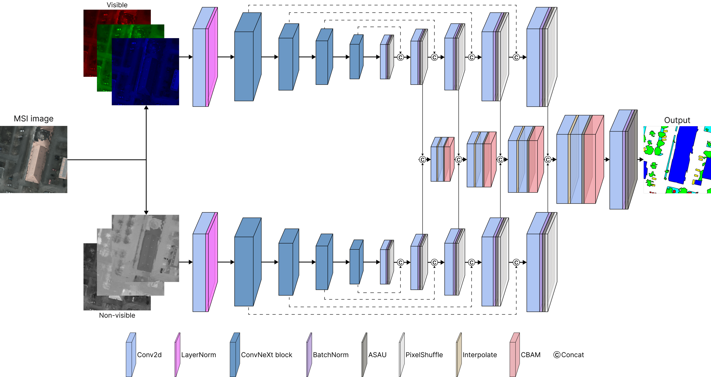

<!--# Multi-encoder ConvNeXt Network with Attentional Feature Fusion for Multispectral Semantic Segmentation-->
<!-- # Dual-branch ConvNeXt-based Network with Attentional Fusion Decoding for Land Cover Classification Using Multispectral Imagery -->

<div align="center">
  
# Multi-encoder ConvNeXt Network with Smooth Attentional Feature Fusion for Multispectral Semantic Segmentation
[Leo Thomas Ramos](https://www.linkedin.com/in/leo-thomas-ramos/), [Angel D. Sappa](https://es.linkedin.com/in/angel-sappa-61532b17)<br/>
Correspondence: ltramos@cvc.uab.cat
</div>

<!-- ABOUT THE PROJECT -->
<div align="center">

</div>

## Announcements

<!--at []() ! 📣 -->

- An extended and improved version is on the way
- Our conference paper is now available on [IEEE Xplore](https://ieeexplore.ieee.org/document/10971457)
- Our work has been accepted for presentation at IEEE SoutheastCon 2025 (see you in Concord, USA)

## About the project

<!--This work proposes MeCSAFNet, a multi-branch encoder-decoder architecture for land cover segmentation in multispectral imagery. The model separately processes visible and non-visible channels through dual ConvNeXt encoders, followed by individual decoders that reconstruct spatial information. A dedicated fusion decoder integrates intermediate features at multiple scales, combining fine spatial cues with high-level spectral representations. The feature fusion is further enhanced with CBAM attention, and the ASAU activation function contributes to stable and efficient optimization. The model is designed to process different spectral configurations, including a 4-channel input combining RGB and NIR bands, as well as a 6-channel input incorporating NDVI and NDWI indices. Experiments on the Five-Billion-Pixels (FBP) and Potsdam datasets demonstrate significant performance gains. On FBP, MeCSAFNet-base (6c) surpasses U-Net (4c) by +19.21\%, U-Net (6c) by +14.72\%, SegFormer (4c) by +19.62\%, and SegFormer (6c) by +14.74\% in mIoU. On Potsdam, MeCSAFNet-large (4c) improves over DeepLabV3+ (4c) by +6.48\%, DeepLabV3+ (6c) by +5.85\%, SegFormer (4c) by +9.11\%, and SegFormer (6c) by +4.80\% in mIoU. The model also achieves consistent gains over several recent state-of-the-art approaches. Moreover, compact variants of MeCSAFNet deliver notable performance with lower training time and reduced inference cost, supporting their deployment in resource-constrained environments.-->

<!-- GETTING STARTED -->
## Installation

pip install git+https://github.com/Leo-Thomas/mecsafnet.git

## Dataset
We use two well-known datasets for semantic segmentation:
* ISPRS Potsdam which can be found [here](https://www.isprs.org/education/benchmarks/UrbanSemLab/2d-sem-label-potsdam.aspx).
* Five-Billion-Pixels which can be found [here](https://x-ytong.github.io/project/Five-Billion-Pixels.html).

Details of splitting and pre-processing can be found in the “implementation details” sections of our papers.

## Main results


Performance of the different MeCSAFNet variants on the **Five-Billion-Pixels** dataset:
| Model | OA | mIoU | mF1 | Training time (h) |  Speed (s)  |
|------|------|------|------|------|------
**RGB-NIR**
| MeCSAFNet-tiny   | 90.21   | 69.18   | 79.92   | 10.05   | 0.0319   |
| MeCSAFNet-small   | 90.47   | 71.08   | 81.13   | 14.46   | 0.0513 |
| MeCSAFNet-base   | 90.72  | 71.23   | 81.45  | 18.30  | 0.0509 |
| MeCSAFNet-large  | 90.54   | 70.53   | 81.04   | 19.86   | 0.0503   |
**RGB-NIR-NDVI-NWDI**
| MeCSAFNet-tiny   | 90.42   | 70.60  | 81.04  | 12.72  | 0.0324 |
| MeCSAFNet-small   | 90.59 | 71.40 | 81.86 | 16.90 | 0.0512|
| MeCSAFNet-base   | 91.79 | 72.79 | 82.54 | 19.80 | 0.0507 |
| MeCSAFNet-large  | 90.52 | 71.69 | 81.82 | 22.36 | 0.0508 |


Performance of the different MeCSAFNet variants on the **Potsdam** dataset:

| Model | OA | mIoU | mF1 | Training time (h) |  Speed (s)  |
|------|------|------|------|------|------
**RGB-NIR**
| MeCSAFNet-tiny   | 90.87   | 83.56 | 90.90  | 2.16 | 0.0310  |
| MeCSAFNet-small   | 90.91 | 83.63  | 90.97 | 2.90 | 0.0499 |
| MeCSAFNet-base   | 91.06 | 84.03 | 91.19 | 3.72 | 0.0497 |
| MeCSAFNet-large  | 91.17 | 84.16 | 91.27 | 5.26 | 0.0499  |
**RGB-NIR-NDVI-NWDI**
| MeCSAFNet-tiny   | 90.93  | 83.72 | 91.00 | 2.83 | 0.0494 |
| MeCSAFNet-small   | 90.97 | 83.84 | 91.08 | 2.83 | 0.0494 |
| MeCSAFNet-base   | 91.18 | 84.14 | 91.24 | 4.16 | 0.0500 |
| MeCSAFNet-large  | 91.13 | 94.07 | 91.21 | 5.91 | 0.0537 |


## Summary of changes in the extended version

The following table summarizes the key differences between the original conference version and the extended journal version of this work. Understanding these distinctions is important for reproducing results or selecting the appropriate configuration for training and evaluation.

| Feature                         | Conference                              | Extended (Journal)                                              |
|---------------------------------|------------------------------------------|------------------------------------------------------------------|
| Datasets                        | Potsdam dataset only                     | Potsdam, Five-Billion-Pixels                                     |
| Input channels                  | RGB-NIR (4c)                             | RGB-NIR (4c); RGB-NIR-NDVI-NDWI (6c)                             |
| Training epochs                 | 100 epochs training                      | 150 epochs training                                              |
| Activation function             | ReLU activation function                 | ASAU activation function                                         |
| Loss function                   | Cross-entropy                            | Cross-entropy + 0.5 Dice                                         |
| Training schedule               | Simple training schedule                 | OneCycleLR, Automatic Mixed Precision                            |
| Evaluation metrics              | OA, IoU, mIoU                            | OA, IoU, mIoU, mF1                                               |

<!-- CONTRIBUTING 
## Contributing

Contributions are what make the open source community such an amazing place to learn, inspire, and create. Any contributions you make are **greatly appreciated**.

If you have a suggestion that would make this better, please fork the repo and create a pull request. You can also simply open an issue with the tag "enhancement".
Don't forget to give the project a star!

1. Fork the Project
2. Create your Feature Branch (`git checkout -b feature/NewFeature`)
3. Commit your Changes (`git commit -m 'Add some NewFeature'`)
4. Push to the Branch (`git push origin feature/NewFeature`)
5. Open a Pull Request

<p align="right">(<a href="#top">back to top</a>)</p>
-->


<!-- LICENSE -->
## License

Distributed under the GNU General Public License v3.0. See `LICENSE` for more information.

<!-- CITAITON -->
## Citation

If you find our work useful please star ⭐️ our repo and cite 📄 our papers. 

```
@INPROCEEDINGS{10971457,
  author={Ramos, Leo Thomas and Sappa, Angel D.},
  booktitle={SoutheastCon 2025}, 
  title={Dual-Branch ConvNeXt-Based Network with Attentional Fusion Decoding for Land Cover Classification Using Multispectral Imagery}, 
  year={2025},
  location={Concord, NC, USA},
  pages={187-194},
  doi={10.1109/SoutheastCon56624.2025.10971457}}
```
<!-- CONTACT 
## Contact

Leo Thomas Ramos - [LinkedIn](https://www.linkedin.com/in/leo-thomas-ramos/) - ltramos@cvc.uab.cat

Angel D. Sappa - [LinkedIn](https://es.linkedin.com/in/angel-sappa-61532b17) - asappa@cvc.uab.cat


<p align="right">(<a href="#top">back to top</a>)</p>-->
